# IAM-Gateway — Project Documentation

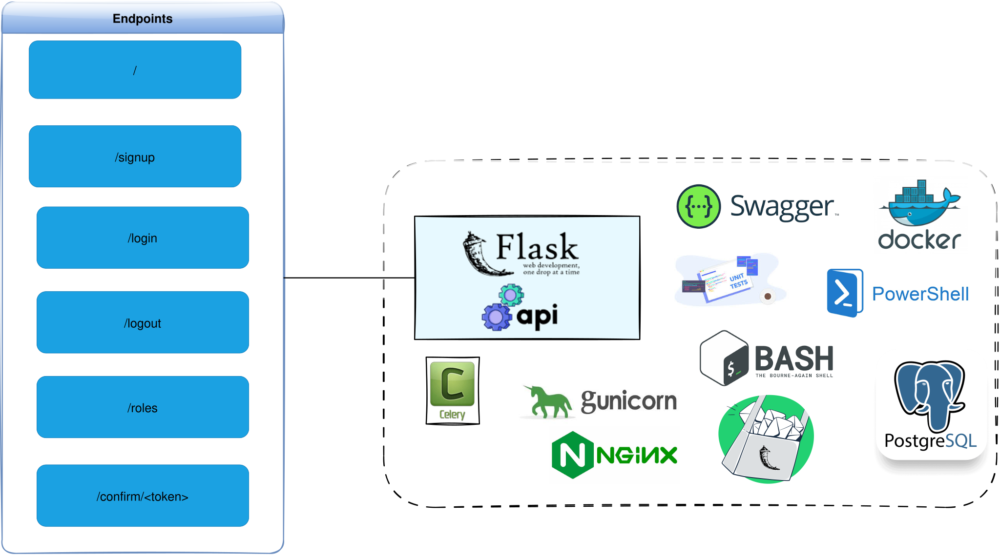

---

## Table of Contents

1. [Project Overview](#1-project-overview)
2. [Architecture](#2-architecture)
3. [Technology Stack](#3-technology-stack)
4. [Environments](#4-environments)
5. [Application Flows](#5-application-flows)
6. [Database Models](#6-database-models)
7. [Security Mechanisms](#7-security-mechanisms)
8. [Docker Manager Usage](#8-docker-manager-usage)
9. [CI/CD Pipeline — Best Practices for VPS Deployment](#9-cicd-pipeline--best-practices-for-vps-deployment)
10. [Enhancement Proposals (User Stories)](#10-enhancement-proposals-user-stories)

---

## 1. Project Overview

**IAM-Gateway** is an Identity and Access Management (IAM) gateway portal built with Python and the Flask framework. It serves as a centralized authentication and authorization microservice exposing a REST API for:

- **User registration** (signup with username, email, password, and role)
- **User authentication** (login with email/password, JWT session creation)
- **User logout** (JWT invalidation, session termination)
- **Email-based account activation** (one-time token sent by email, confirmation endpoint)
- **Role management** (adding roles to authenticated users)
- **API endpoint call statistics** (automatic tracking of endpoint usage)
- **Swagger API documentation** (interactive UI for API exploration)

The application follows a layered architecture with clear separation between configuration, core business logic, authentication/authorization, and routing. It supports five distinct environments (local, testing, development, staging, production) and is containerized using Docker with both development and production-ready configurations. The production setup employs Gunicorn as the WSGI application server behind an Nginx reverse proxy.

Key design patterns include:
- **Circuit Breaker** (via `pybreaker`) to protect external password-scoring API calls from cascading failures
- **Retry** (via `tenacity`) for resilient external service communication
- **Decorator-based middleware** for authorization guards, payload validation, and endpoint statistics
- **Multi-stage Docker builds** for optimized image size
- **Schema-based database isolation** per environment

---

## 2. Architecture

### High-Level Architecture

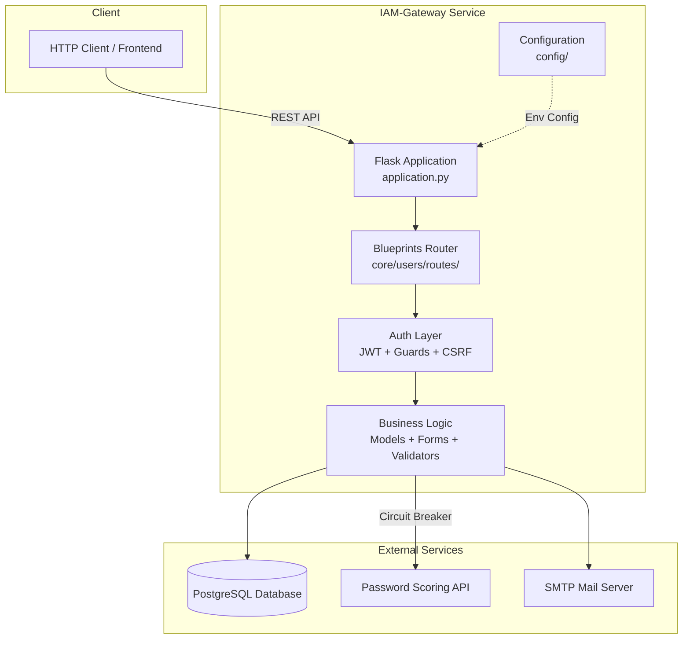

### Production Deployment Architecture

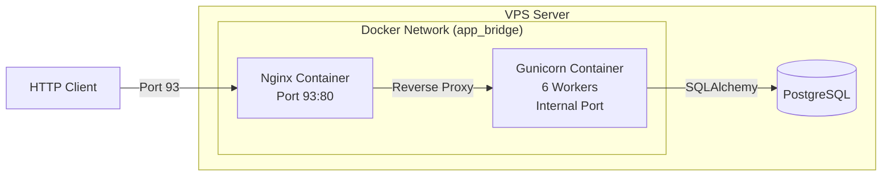

### Application Initialization Flow

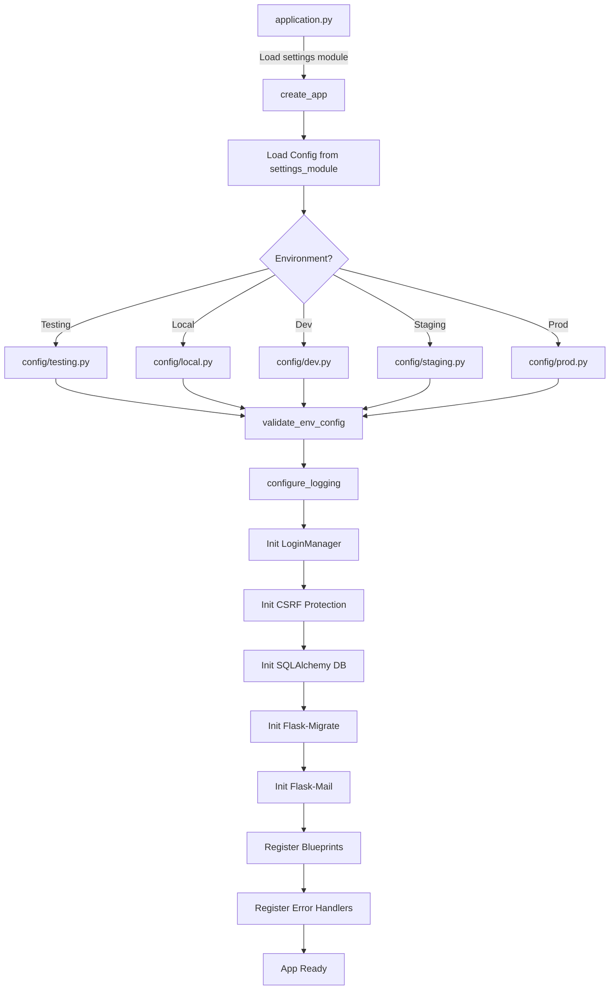

---

## 3. Technology Stack

### Core Framework

| Technology | Version | Purpose |
|---|---|---|
| **Python** | >= 3.11 (3.12 in Docker) | Runtime language |
| **Flask** | ~3.1.0 | Web framework |
| **Gunicorn** | (production) | WSGI application server |
| **uv** | >= 0.4.0 | Python package manager |

### Flask Extensions

| Extension | Version | Purpose |
|---|---|---|
| **Flask-Login** | ~0.6.3 | User session management |
| **Flask-Mail** | ~0.10.0 | Email sending (activation, notifications) |
| **Flask-Migrate** | ~4.1.0 | Database migration management (Alembic wrapper) |
| **Flask-SQLAlchemy** | ~3.1.1 | ORM integration |
| **Flask-WTF** | ~1.2.2 | Form and CSRF handling |
| **Flask-Swagger-UI** | >= 5.21.0 | Interactive API documentation |

### Database & ORM

| Technology | Version | Purpose |
|---|---|---|
| **PostgreSQL** | — | Relational database |
| **SQLAlchemy** | >= 2.0.40 | ORM |
| **Alembic** | >= 1.15.2 | Database migration engine |
| **psycopg2** | ~2.9.10 | PostgreSQL driver |

### Authentication & Security

| Technology | Version | Purpose |
|---|---|---|
| **PyJWT** | >= 2.10.1 | JWT creation and validation |
| **itsdangerous** | (bundled with Flask) | Secure token serialization for email activation |
| **Werkzeug** | (bundled with Flask) | Password hashing (PBKDF2) |
| **Flask-WTF / CSRFProtect** | — | CSRF token management |

### Resilience & External Services

| Technology | Version | Purpose |
|---|---|---|
| **PyBreaker** | >= 1.3.0 | Circuit breaker pattern |
| **Tenacity** | >= 9.1.2 | Retry mechanism |
| **Requests** | >= 2.32.3 | HTTP client for external API calls |

### Validation & Utilities

| Technology | Version | Purpose |
|---|---|---|
| **email-validator** | ~2.2.0 | Email format validation |
| **python-usernames** | >= 1.0.0 | Username validation |
| **python-slugify** | ~8.0.4 | Slug generation |
| **arrow** | >= 1.3.0 | Date/time utilities (UTC) |
| **dotenv** | ~0.9.9 | Environment variable loading |

### Infrastructure & DevOps

| Technology | Version | Purpose |
|---|---|---|
| **Docker** | >= 20.10.21 | Containerization |
| **Docker Compose** | >= 1.29.2 | Multi-container orchestration |
| **Nginx** | latest (Alpine) | Reverse proxy (production) |
| **pre-commit** | >= 4.2.0 | Git hooks for code quality |

### Code Quality

| Tool | Purpose |
|---|---|
| **Black** | Code formatter (line-length 79) |
| **isort** | Import sorting (black profile) |
| **pre-commit** | Git hooks automation |

---

## 4. Environments

The application supports **five environments**, each defined by a dedicated configuration module under `config/` inheriting from `config/default.py`, and a corresponding `.env.*` file.

| Environment | Config Module | Env File | DEBUG | TESTING | Notes |
|---|---|---|---|---|---|
| **Local** | `config.local` | `.env.local` | `True` | `False` | Developer workstation; `LOCAL_DEV=True` |
| **Testing** | `config.testing` | `.env.testing` | `True` | `True` | Unit tests; CSRF disabled (`WTF_CSRF_ENABLED=False`) |
| **Development** | `config.dev` | `.env.dev` | `True` | `False` | Docker-based shared dev environment |
| **Staging** | `config.staging` | `.env.staging` | `False` | `False` | Pre-production validation |
| **Production** | `config.prod` | `.env.prod` | `False` | `False` | Live environment with Gunicorn + Nginx |

### Environment Configuration Hierarchy

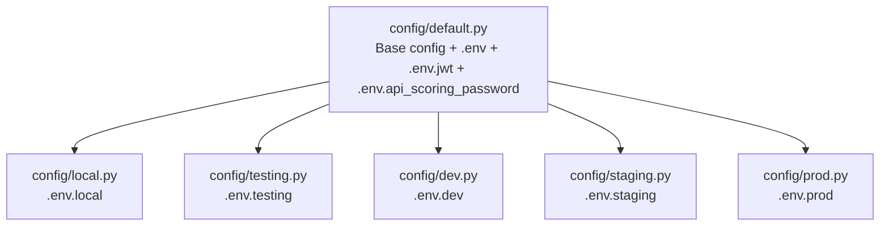

### Environment Variables Loaded

Each environment configuration loads:
1. **Base** (`config/.env`): `APP_NAME`, `APP_VERSION`, `SECRET_KEY`, `SECURITY_PASSWORD_SALT`, log paths, email server settings, file upload settings
2. **JWT** (`config/jwt/.env.jwt`): `ENCODING`, `JWT_ALG`, `JWT_EXPIRATION_TIME`, encoding parameters
3. **External APIs** (`config/external_ws_apis/.env.api_scoring_password`): password scoring API URL, username/password rules, circuit breaker configuration
4. **Per-environment** (`.env.local`, `.env.dev`, etc.): `DB_HOSTNAME`, `DB_PORT`, `DB_NAME`, `SQLALCHEMY_DATABASE_URI`, `SQLALCHEMY_DATABASE_SCHEMA`

### Logging Behavior per Environment

| Environment | Log Level | Console | File | Email Alerts |
|---|---|---|---|---|
| Local / Testing / Dev | `DEBUG` | Yes | Yes | No |
| Staging / Production | `INFO` | Yes | Yes | Yes (if `APP_SEND_EMAILS=True`) |

---

## 5. Application Flows

### 5.1 Signup Flow

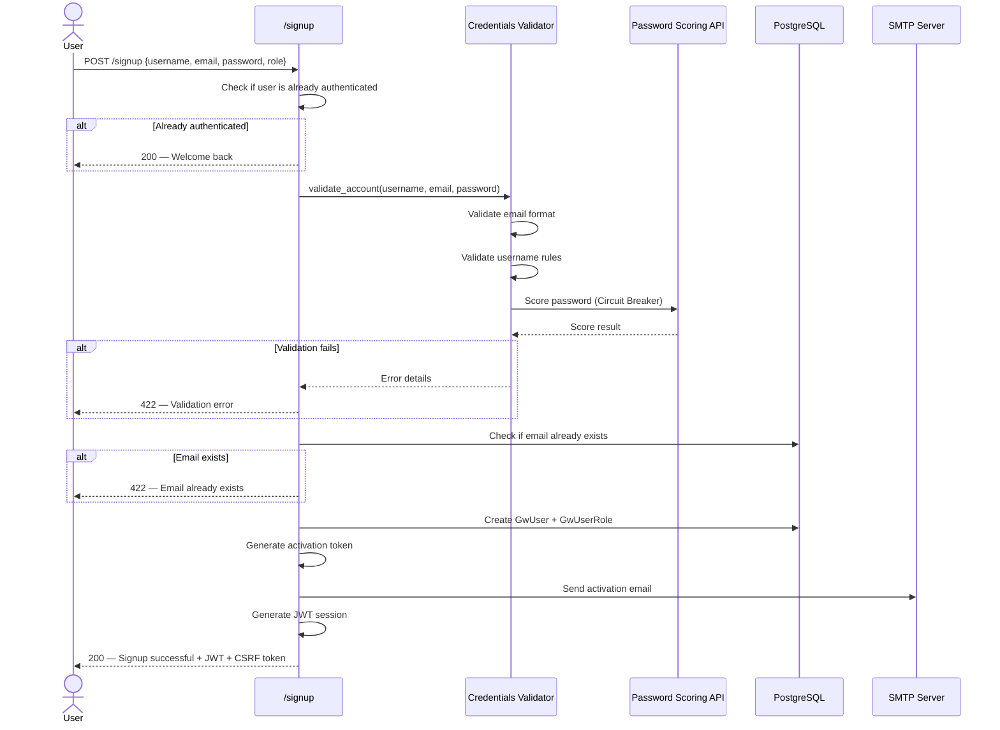

### 5.2 Login Flow

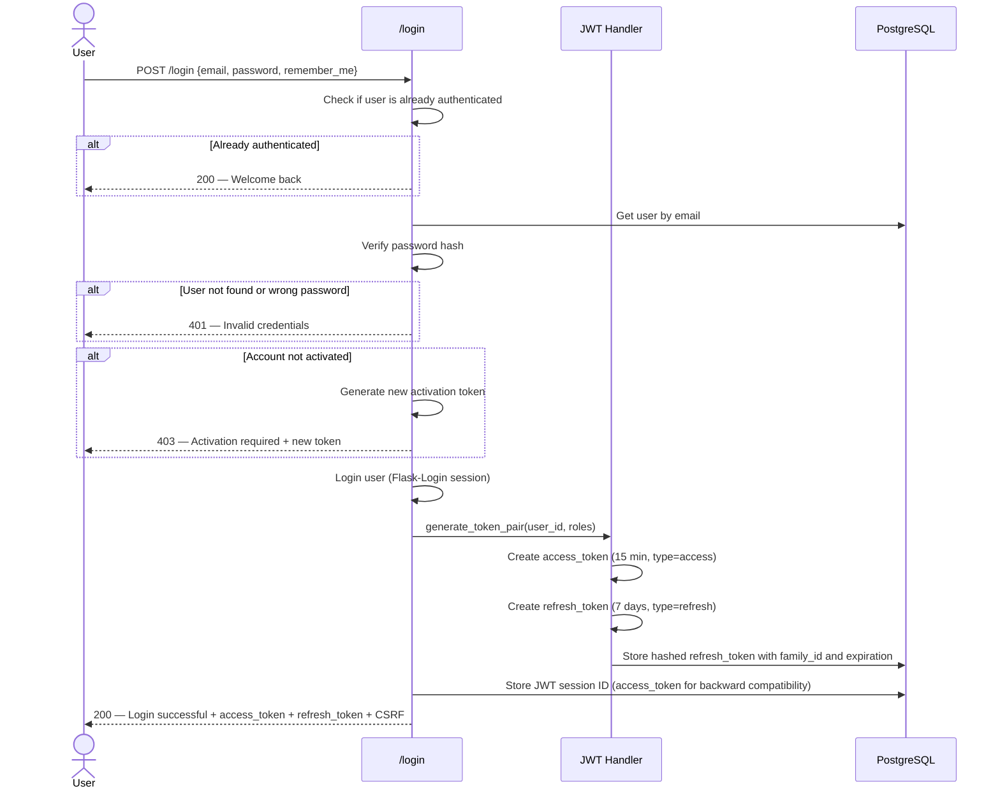

### 5.3 Logout Flow

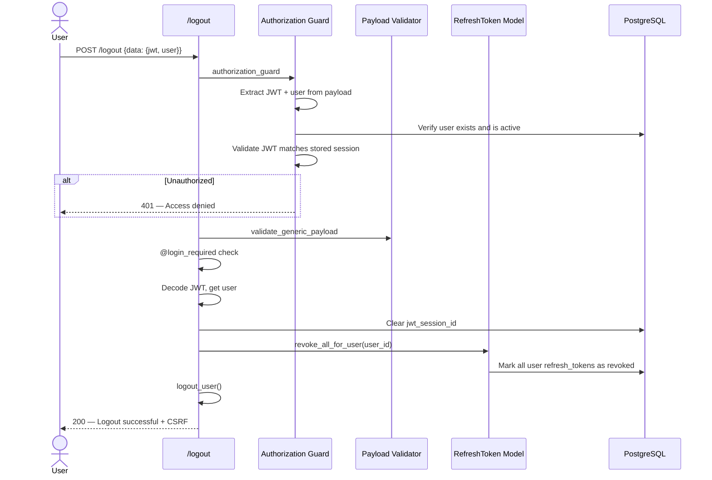

### 5.3.1 Token Refresh Flow

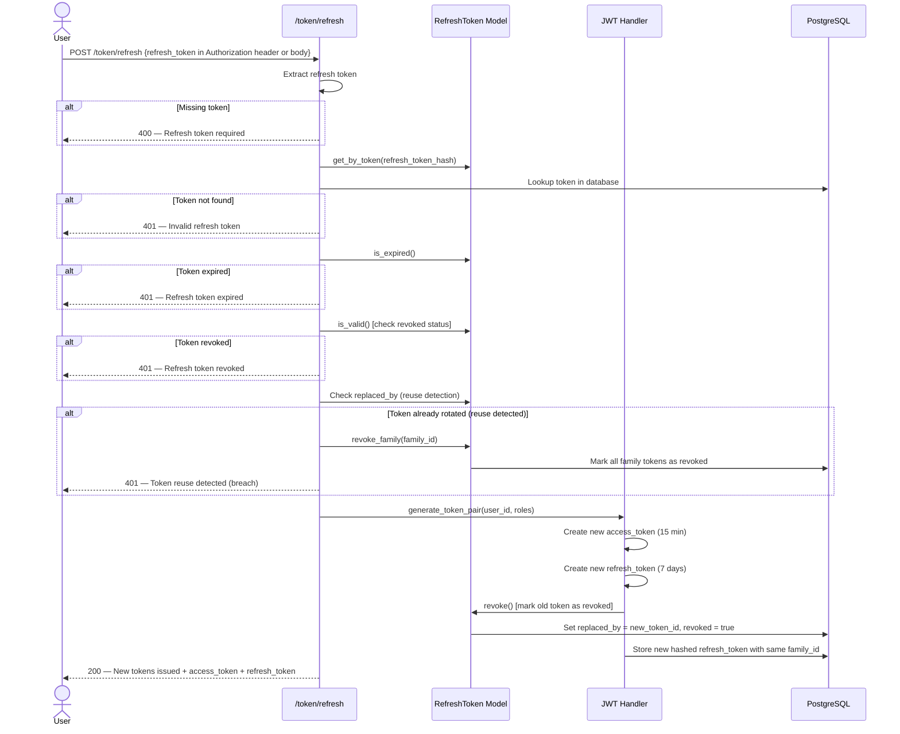

### 5.4 Email Activation Flow

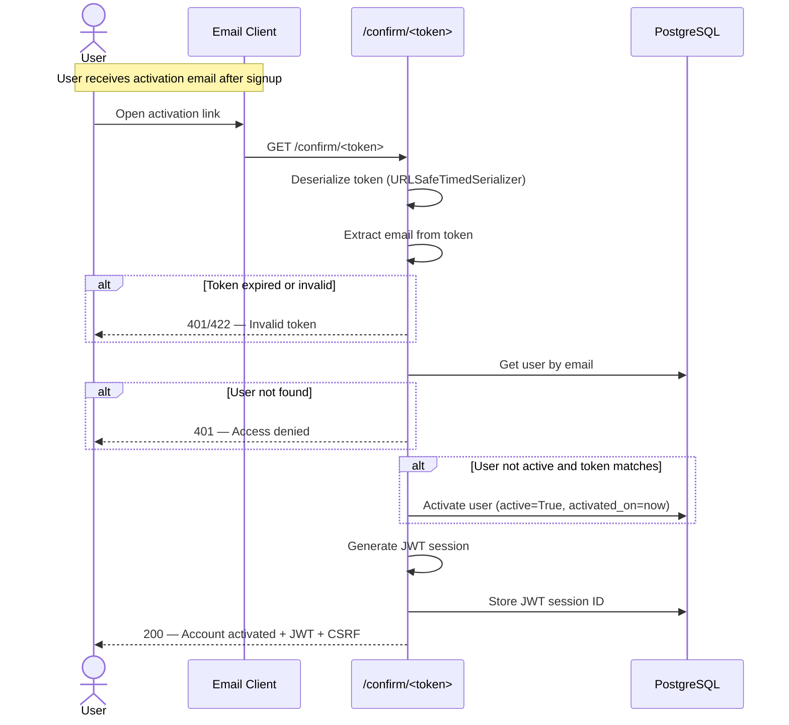

### 5.5 Resend Confirmation Email Flow

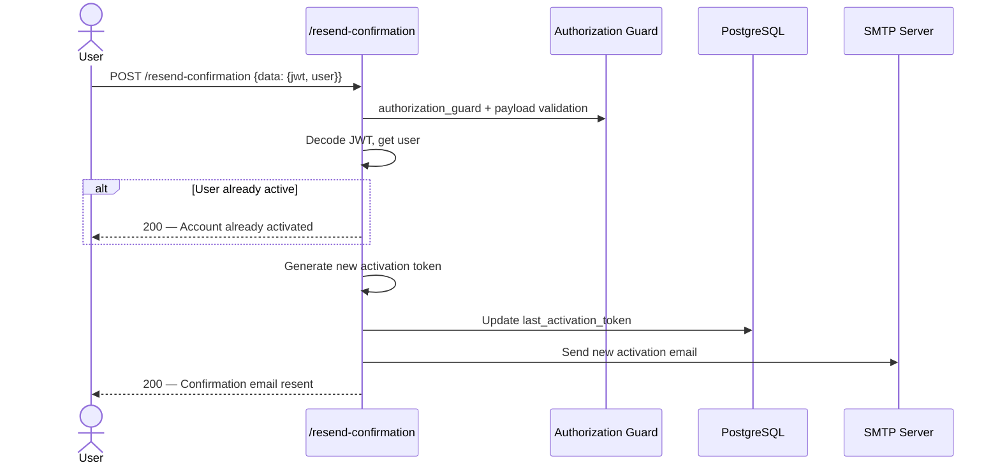

### 5.6 Role Assignment Flow

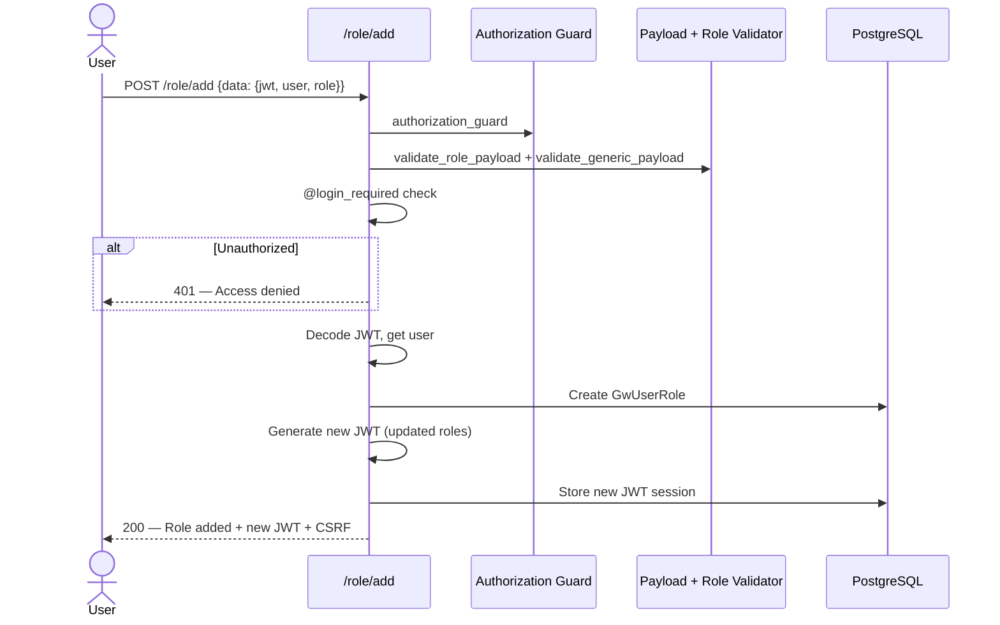

### 5.7 Request Lifecycle Overview

```mermaid
flowchart LR
    A[Incoming Request] --> B{Route Type}
    B -->|Public| C[sanity_check / signup / login / confirm]
    B -->|Protected| D[authorization_guard]
    D --> E[validate_generic_payload]
    E --> F[@login_required]
    F --> G[count_api_calls]
    G --> H[Route Handler]
    C --> G
    H --> I[JSON Response + X-CSRFToken Header]
```

### 5.8 Password Reset Flow

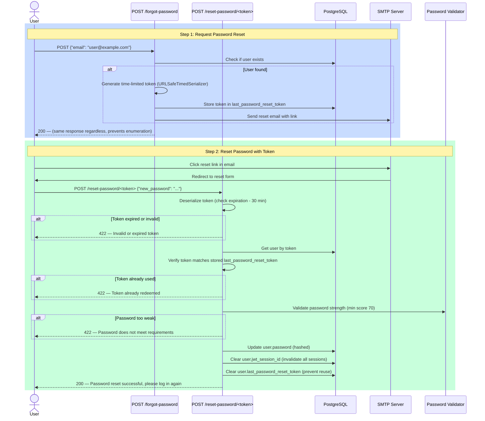

**Key Security Features:**
- **Email Enumeration Prevention:** `/forgot-password` returns identical responses for existing and non-existing emails
- **Rate Limiting:** `/forgot-password` limited to 3 requests per hour per IP
- **Token Expiration:** Reset tokens expire after 30 minutes (configurable)
- **Token Reuse Prevention:** Token is cleared from database after successful reset
- **Session Invalidation:** User's JWT session is invalidated, forcing a fresh login
- **Password Strength:** New password validated via external scoring API (minimum score 70)

---

## 6. Database Models

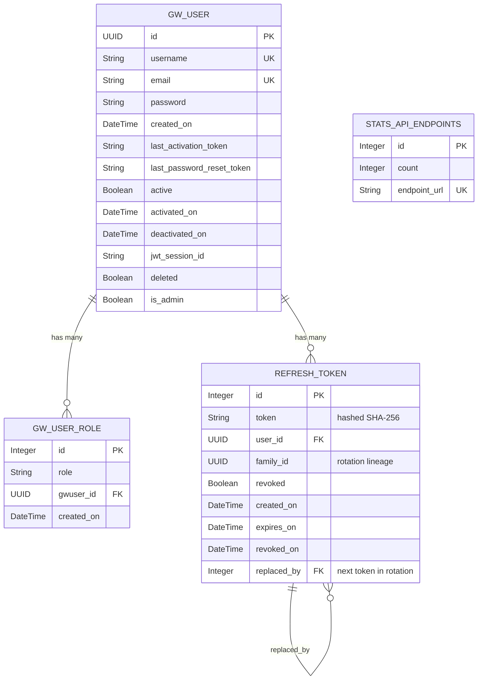

---

## 7. Security Mechanisms

| Mechanism | Implementation | Description |
|---|---|---|
| **Password Hashing** | Werkzeug `generate_password_hash` (PBKDF2, salt_length=25) | Passwords never stored in plain text |
| **JWT Authentication** | PyJWT with configurable algorithm and expiration | Stateful JWT stored in DB (`jwt_session_id`) |
| **CSRF Protection** | Flask-WTF `CSRFProtect` + `X-CSRFToken` response header | Every response includes a fresh CSRF token |
| **Authorization Guard** | Custom decorator checking JWT + user existence + activation status | Applied to all protected routes |
| **Payload Validation** | Custom decorators `validate_generic_payload`, `validate_role_payload` | Validates JSON structure before processing |
| **Email Activation** | `itsdangerous.URLSafeTimedSerializer` with time-limited tokens | One-time tokens with configurable expiration |
| **Password Reset** | `itsdangerous.URLSafeTimedSerializer` with time-limited tokens (30 min) | Time-limited reset tokens; stored in DB and cleared after use |
| **Password Reset Email** | Enumeration prevention (identical responses) + rate limiting (3/hour) | Prevents account discovery; rate limit on forgot-password endpoint |
| **Session Invalidation** | JWT session ID cleared on password reset | Forces user to re-login after password change |
| **Refresh Token Mechanism** | Dual-token system: short-lived access (15 min) + long-lived refresh (7 days) | Access tokens used for API auth; refresh tokens stored securely in DB (SHA-256 hashed) |
| **Token Rotation** | Family ID tracking with `replaced_by` relationship | Old refresh tokens marked as revoked when new ones issued; lineage tracked for security |
| **Token Reuse Detection** | Automatic family-wide revocation on replayed tokens | If rotated token presented again (breach detection), entire token family revoked with 401 response |
| **Token Storage** | RefreshToken SQLAlchemy model with encrypted hash + expiration | Tokens never stored in plain text; indices on user_id, family_id, and token_hash for performance |
| **Circuit Breaker** | PyBreaker with configurable `fail_max` and `reset_timeout` | Protects against external password-scoring API failures |
| **Input Validation** | email-validator, python-usernames, custom validators | Validates usernames, emails, and password strength |
| **Configuration Validation** | `validate_config.py` checks all required env vars at startup | Fail-fast on missing configuration |

---

## 8. Docker Manager Usage

The `docker_manager.sh` script is an interactive CLI tool that simplifies Docker image and container lifecycle management. It provides a menu-driven interface to build, run, and stop Docker containers for the IAM-Gateway application.

### Prerequisites

- Docker and Docker Compose installed
- The script must be executed from the project root directory
- Execute permissions: `chmod +x docker_manager.sh`

### Launching the Manager

```bash
./docker_manager.sh
```

### Interactive Menu

Upon launch, the script clears the terminal and displays:

```
------------------------------------------------------------------------------------------
                 Manager for the docker images of the application
------------------------------------------------------------------------------------------
 1. Create a new docker image
 2. Run a docker container
 3. Stop a docker container
 4. Exit
------------------------------------------------------------------------------------------
Enter your choice (1-4):
```

### Option 1 — Create a New Docker Image

This option builds a Docker image for the chosen environment.

**Interactive prompts:**

1. **Environment selection** — Enter `dev` or `prod`
2. **Application name** — Enter a new name or press Enter to keep the current one (stored in `Docker/application/<env>/app.name.env`)
3. **Version number** — Enter a version matching the pattern `X.Y.Za` (e.g., `0.3.1f`). The version is validated against the regex `^[0-9]\.[0-9]\.[0-9][a-zA-Z]$`

**What happens:**
- Updates `app.name.env` and `app.version.env` in the chosen environment directory
- Exports `APP_VERSION`, `APP_ENV`, and `APP_NAME` as environment variables
- Runs `docker compose -f Docker/application/<env>/docker-compose-<env>.yaml build`

**Dev build:** Uses `python:3.12-alpine` multi-stage build, produces a lightweight image with pre-compiled wheels.

**Prod build:** Same Dockerfile, but the `docker-compose-prod.yaml` uses Gunicorn with 6 workers and adds an Nginx reverse proxy container.

### Option 2 — Run a Docker Container

This option starts a container from a previously built image.

**Interactive prompts:**

1. **Environment selection** — Enter `dev` or `prod`

**What happens:**
- Reads the current app name and version from env files
- Exports the environment variables
- Runs `docker compose -f Docker/application/<env>/docker-compose-<env>.yaml up`

**Port mappings:**
- **Dev**: Host port `5011` → Container port `5000` (Flask dev server)
- **Prod**: Host port `93` → Nginx port `80` → Gunicorn internal port

### Option 3 — Stop a Docker Container

This option stops running containers for the chosen environment.

**Interactive prompts:**

1. **Environment selection** — Enter `dev` or `prod`

**What happens:**
- Reads the current app name and version
- Runs `docker compose ... down` with all relevant env files

### Option 4 — Exit

Exits the script gracefully.

### Docker Compose Configuration Summary

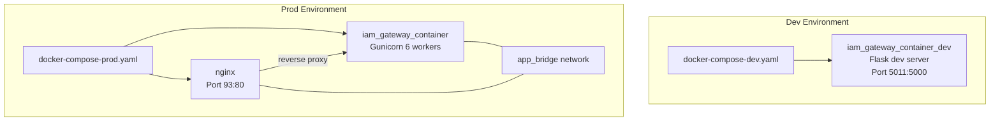

### Image Naming Convention

Docker images are tagged following the pattern:
```
${DOCKER_REGISTRY}/${DOCKER_REPOSITORY}:${APP_NAME}-${APP_ENV}-${APP_VERSION}
```

Example: `registry.example.com/iam:iam-gateway-prod-1.0.0a`

---

## 9. CI/CD Pipeline — Best Practices for VPS Deployment

Given the application will be deployed on a **VPS server** with the codebase hosted on **GitHub**, the following CI/CD pipeline architecture is recommended using **GitHub Actions** following a **DevSecOps** methodology.

### Pipeline Architecture

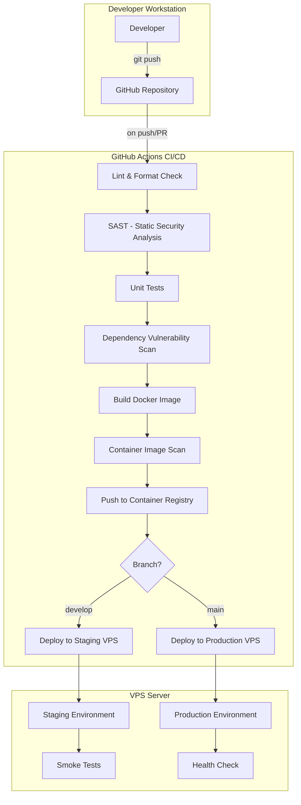

### Recommended GitHub Actions Workflow Stages

#### Stage 1 — Code Quality & Linting
- Run `black --check` and `isort --check-only` to enforce code style
- Run `pre-commit run --all-files` for all configured hooks
- Fail the pipeline on style violations

#### Stage 2 — Static Application Security Testing (SAST)
- **Bandit** — Scan Python code for common security issues (hardcoded secrets, SQL injection, etc.)
- **Semgrep** — Advanced static analysis with security rules for Flask applications
- **Gitleaks** — Scan for secrets committed into the repository (API keys, passwords, tokens)

#### Stage 3 — Unit & Integration Tests
- Run the test suite: `uv run -m unittest tests.test_standard_routes`
- Generate code coverage reports (recommend `pytest-cov`)
- Set a minimum coverage threshold (e.g., 80%)

#### Stage 4 — Dependency Vulnerability Scanning
- **pip-audit** or **Safety** — Scan `requirements.txt` / `pyproject.toml` dependencies for known CVEs
- **Dependabot** — Enable automated dependency update PRs on GitHub

#### Stage 5 — Docker Image Build
- Build the multi-stage Docker image
- Tag with commit SHA and semantic version
- Cache Docker layers for faster builds

#### Stage 6 — Container Image Scanning
- **Trivy** — Scan the built Docker image for OS and application vulnerabilities
- **Grype** — Alternative/complementary container scanner
- Fail the build if critical/high vulnerabilities are detected

#### Stage 7 — Push to Container Registry
- Push to **GitHub Container Registry (ghcr.io)** or a self-hosted registry
- Tag images with: `latest`, `<branch>-<sha>`, `<semver>`

#### Stage 8 — Deployment to VPS
- Use SSH-based deployment via GitHub Actions (`appleboy/ssh-action` or custom scripts)
- Pull the new image on the VPS server
- Run `docker compose down && docker compose up -d` with zero-downtime strategy
- Alternatively, use **Watchtower** for automatic container updates

#### Stage 9 — Post-Deployment Verification
- Run smoke tests against the deployed application (health check on `/`)
- Verify the sanity check endpoint returns `200`
- Send notifications (Slack, email) on pipeline success/failure

### Branching Strategy

```mermaid
gitgraph
    commit id: "initial"
    branch develop
    checkout develop
    commit id: "feature-a"
    branch feature/user-profile
    checkout feature/user-profile
    commit id: "add-profile-model"
    commit id: "add-profile-routes"
    checkout develop
    merge feature/user-profile id: "merge-feature"
    commit id: "staging-deploy"
    checkout main
    merge develop id: "release-1.0.0" tag: "v1.0.0"
    commit id: "prod-deploy"
```

| Branch | Purpose | Deploys to | Protection |
|---|---|---|---|
| `feature/*` | Feature development | — | PR required |
| `develop` | Integration branch | Staging VPS | PR required, CI must pass |
| `main` | Production releases | Production VPS | PR required, CI must pass, approval required |
| `hotfix/*` | Critical production fixes | Production VPS | PR to main + back-merge to develop |

### VPS Server Hardening Recommendations

| Area | Recommendation |
|---|---|
| **SSH** | Disable root login, key-only auth, non-standard port |
| **Firewall** | UFW/iptables allowing only ports 80, 443, SSH |
| **TLS** | Let's Encrypt with Certbot for HTTPS on Nginx |
| **Docker** | Run containers as non-root, enable user namespaces |
| **Secrets** | Use GitHub Secrets for env vars; never commit `.env` files |
| **Monitoring** | Prometheus + Grafana or Netdata for server metrics |
| **Log Aggregation** | Centralized logging with Loki or ELK stack |
| **Backups** | Automated PostgreSQL backups with `pg_dump`, off-site storage |
| **Updates** | Unattended-upgrades for OS security patches |

### Recommended GitHub Actions Workflow File Structure

```
.github/
  workflows/
    ci.yml            # Lint, SAST, test, build on every PR
    cd-staging.yml     # Deploy to staging on merge to develop
    cd-production.yml  # Deploy to production on merge to main
    security-scan.yml  # Scheduled weekly dependency & image scans
```

---

## 10. Enhancement Proposals (User Stories)

### US-001 — Rate Limiting on Authentication Endpoints

| Field | Value |
|---|---|
| **Title** | Implement Rate Limiting on Signup and Login Endpoints |
| **Description** | As a **security engineer**, I want to enforce rate limiting on the `/signup` and `/login` endpoints so that the API is protected against brute-force attacks and credential stuffing. The rate limiter should support configurable thresholds per IP address (e.g., 5 login attempts per minute) and return HTTP 429 when exceeded. Implementation should use `Flask-Limiter` backed by Redis for distributed rate tracking across Gunicorn workers. |
| **Priority** | **Critical** |
| **Estimated Cost** | **3 Story Points** (~1.5 days) |

---

### US-002 — Password Reset / Forgot Password Flow

| Field | Value |
|---|---|
| **Title** | Add Password Reset Functionality via Email |
| **Description** | As a **user**, I want to be able to reset my password if I forget it, so that I can regain access to my account. The system should expose a `/forgot-password` endpoint that accepts an email, generates a time-limited reset token (using `itsdangerous`), sends a reset link via email, and provides a `/reset-password/<token>` endpoint to set a new password. The old password should be invalidated, the JWT session revoked, and the user required to log in again. |
| **Priority** | **Critical** |
| **Estimated Cost** | **5 Story Points** (~2.5 days) |

---

### US-003 — Refresh Token Mechanism

| Field | Value |
|---|---|
| **Title** | Implement JWT Refresh Token for Session Continuity |
| **Description** | As a **user**, I want my session to remain active without re-entering credentials frequently, so that I have a seamless experience. Currently, the JWT has a single expiration with no refresh mechanism. A short-lived access token (15 min) paired with a long-lived refresh token (7 days) should be issued. A `/token/refresh` endpoint should accept a valid refresh token and return a new access token. Refresh tokens must be stored securely in the database with rotation and revocation support. |
| **Priority** | **High** |
| **Estimated Cost** | **5 Story Points** (~2.5 days) |

---

### US-004 — Structured JSON Logging

| Field | Value |
|---|---|
| **Title** | Replace Text Logging with Structured JSON Logs |
| **Description** | As a **DevOps engineer**, I want the application to output logs in structured JSON format, so that logs can be easily parsed, searched, and aggregated by centralized log management tools (ELK, Loki, Datadog). Each log entry should include: timestamp, log level, logger name, function, line number, request ID, user ID (if authenticated), and the message. The `python-json-logger` library should be used. Console output should remain human-readable in local/dev environments. |
| **Priority** | **High** |
| **Estimated Cost** | **3 Story Points** (~1.5 days) |

---

### US-005 — Health Check and Readiness Probes

| Field | Value |
|---|---|
| **Title** | Add Dedicated Health and Readiness Endpoints |
| **Description** | As a **DevOps engineer**, I want dedicated `/health` and `/ready` endpoints, so that container orchestrators and load balancers can determine application status. The `/health` endpoint should return 200 if the process is alive (liveness probe). The `/ready` endpoint should verify database connectivity and external service availability before returning 200 (readiness probe). These endpoints should bypass authentication and CSRF. |
| **Priority** | **High** |
| **Estimated Cost** | **2 Story Points** (~1 day) |
| **Status** | **QA Testing** |

---

### US-006 — API Versioning Strategy

| Field | Value |
|---|---|
| **Title** | Implement Consistent API Versioning via URL Prefix |
| **Description** | As an **API consumer**, I want the API to follow a consistent versioning scheme (e.g., `/api/v1/...`), so that breaking changes can be introduced in new versions without affecting existing clients. Currently, routes are duplicated (e.g., `/signup` and `/<app>/api/<version>/signup`). The API should standardize on a single versioned URL pattern using Flask Blueprints with a `url_prefix`. Legacy unversioned routes should be deprecated with appropriate HTTP `Deprecation` headers. |
| **Priority** | **High** |
| **Estimated Cost** | **3 Story Points** (~1.5 days) |

---

### US-007 — Database Connection Pooling and Health Monitoring

| Field | Value |
|---|---|
| **Title** | Configure SQLAlchemy Connection Pooling with Health Checks |
| **Description** | As a **backend developer**, I want proper database connection pooling with `pre_ping` health checks, so that the application handles database reconnections gracefully and performs well under load. SQLAlchemy Engine options should be configured with `pool_size`, `max_overflow`, `pool_recycle`, and `pool_pre_ping=True`. Connection pool metrics should be exposed at the `/health` endpoint. |
| **Priority** | **Medium** |
| **Estimated Cost** | **2 Story Points** (~1 day) |

---

### US-008 — Dockerize with Non-Root User

| Field | Value |
|---|---|
| **Title** | Run Docker Containers as Non-Root User |
| **Description** | As a **security engineer**, I want the application Docker container to run as a non-root user, so that any container escape vulnerability has limited impact. The Dockerfile should create a dedicated `appuser` with minimal permissions, own the `/app` directory, and execute Gunicorn under this user. The Nginx container should also be configured to run as non-root. |
| **Priority** | **High** |
| **Estimated Cost** | **1 Story Point** (~0.5 day) |

---

### US-009 — CORS Configuration

| Field | Value |
|---|---|
| **Title** | Add Configurable CORS Support |
| **Description** | As a **frontend developer**, I want the API to include proper CORS headers, so that browser-based clients from allowed origins can call the API without cross-origin errors. The implementation should use `Flask-CORS` with environment-specific allowed origins, methods, and headers. Production should restrict origins to known frontend domains only. |
| **Priority** | **Medium** |
| **Estimated Cost** | **1 Story Point** (~0.5 day) |

---

### US-010 — OpenAPI Specification Auto-Generation

| Field | Value |
|---|---|
| **Title** | Auto-Generate OpenAPI/Swagger Spec from Code |
| **Description** | As an **API consumer**, I want the Swagger documentation to be auto-generated from the codebase (docstrings and type hints), so that documentation stays in sync with the implementation. Currently, the Swagger spec is a static JSON file (`static/swagger-docs/swagger.json`). Migrate to `flask-smorest` or `apispec` with `marshmallow` schemas to generate the OpenAPI 3.0 spec dynamically. |
| **Priority** | **Medium** |
| **Estimated Cost** | **5 Story Points** (~2.5 days) |

---

### US-011 — User Profile Management

| Field | Value |
|---|---|
| **Title** | Add User Profile Viewing and Editing |
| **Description** | As a **user**, I want to view and update my profile information (username, email), so that I can manage my account details. A `GET /profile` endpoint should return the authenticated user's information, and a `PUT /profile` endpoint should allow updating username and email (with re-validation and uniqueness checks). Email changes should trigger a new activation flow. |
| **Priority** | **Medium** |
| **Estimated Cost** | **3 Story Points** (~1.5 days) |

---

### US-012 — Account Deletion (GDPR Compliance)

| Field | Value |
|---|---|
| **Title** | Implement User Account Soft Delete and Data Export |
| **Description** | As a **user**, I want to be able to delete my account and export my data, so that my rights under GDPR/data protection regulations are respected. A `DELETE /account` endpoint should soft-delete the user (already partially supported via `deleted` flag and `deactivated_on`). A `GET /account/export` endpoint should return all user data in JSON format. A scheduled job should permanently purge soft-deleted accounts after a retention period (e.g., 30 days). |
| **Priority** | **Medium** |
| **Estimated Cost** | **5 Story Points** (~2.5 days) |

---

### US-013 — Centralized Error Handling with Correlation IDs

| Field | Value |
|---|---|
| **Title** | Add Request Correlation IDs and Standardized Error Responses |
| **Description** | As a **DevOps engineer**, I want every API request to carry a unique correlation ID (`X-Request-ID`), so that I can trace requests across logs and services. All error responses should follow a consistent JSON schema: `{"error": {"code": "...", "message": "...", "request_id": "..."}}`. A middleware should generate or propagate the `X-Request-ID` header and attach it to the Flask `g` object for use in logging and responses. |
| **Priority** | **Medium** |
| **Estimated Cost** | **3 Story Points** (~1.5 days) |

---

### US-014 — Two-Factor Authentication (2FA)

| Field | Value |
|---|---|
| **Title** | Add Optional TOTP-Based Two-Factor Authentication |
| **Description** | As a **security-conscious user**, I want to enable two-factor authentication on my account, so that my account is protected even if my password is compromised. The implementation should use TOTP (Time-based One-Time Passwords) via `pyotp`. Users should be able to enable/disable 2FA from their profile, receive a QR code for authenticator apps, and provide a TOTP code during login. Backup recovery codes should be generated and stored securely. |
| **Priority** | **Low** |
| **Estimated Cost** | **8 Story Points** (~4 days) |

---

### US-015 — Migrate to Async Framework or Add Async Support

| Field | Value |
|---|---|
| **Title** | Evaluate and Implement Async Support for I/O-Bound Operations |
| **Description** | As a **backend developer**, I want external API calls (password scoring) and email sending to be handled asynchronously, so that request latency is reduced and throughput is improved. This can be achieved by introducing Celery with Redis as a message broker for background tasks (email sending, external API calls), or by evaluating a migration to Quart (async Flask) for native async/await support. |
| **Priority** | **Low** |
| **Estimated Cost** | **8 Story Points** (~4 days) |

---

### US-016 — Implement Automated Database Backups

| Field | Value |
|---|---|
| **Title** | Set Up Automated PostgreSQL Backup Strategy |
| **Description** | As a **system administrator**, I want automated daily PostgreSQL database backups with off-site storage, so that data can be recovered in case of failure. A cron-based script should run `pg_dump` daily, compress the output, encrypt it with GPG, and upload to a remote storage (S3-compatible or SFTP). Retention policy: 7 daily, 4 weekly, 3 monthly backups. A restore procedure should be documented and tested quarterly. |
| **Priority** | **High** |
| **Estimated Cost** | **3 Story Points** (~1.5 days) |

---

### US-017 — Add Integration Tests with Testcontainers

| Field | Value |
|---|---|
| **Title** | Create Integration Test Suite with Real PostgreSQL via Testcontainers |
| **Description** | As a **developer**, I want integration tests that run against a real PostgreSQL instance, so that database-specific behaviors (constraints, migrations, transactions) are validated before deployment. Use `testcontainers-python` to spin up a PostgreSQL container during test execution. The CI pipeline should run these tests in a separate stage after unit tests. |
| **Priority** | **Medium** |
| **Estimated Cost** | **5 Story Points** (~2.5 days) |

---

### Enhancement Backlog Summary

| Priority | User Stories | Total Story Points |
|---|---|---|
| **Critical** | US-001, US-002 | 8 SP |
| **High** | US-003, US-004, US-005, US-006, US-008, US-016 | 17 SP |
| **Medium** | US-007, US-009, US-010, US-011, US-012, US-013, US-017 | 24 SP |
| **Low** | US-014, US-015 | 16 SP |
| **Total** | **17 User Stories** | **65 SP** |

---

*Document generated on 2026-02-18. This document should be reviewed and updated as the project evolves.*

---

## 11. Implementation Changelog

### US-001 — Rate Limiting on Authentication Endpoints

| Field | Detail |
|---|---|
| **Branch** | `feature/US-001-rate-limiting` |
| **Status** | In Progress |
| **Started** | 2026-02-18 |
| **Trello** | [US-001](https://trello.com/c/1EvHLJN2) |

#### Changes implemented

| Task | File(s) modified | Summary |
|---|---|---|
| TASK-001-1 | `pyproject.toml`, `requirements.txt`, `core/__init__.py` | Added `flask-limiter[redis]>=3.5.0` and `redis>=5.0.0` dependencies; created global `Limiter` instance with `memory://` fallback; added `limiter.init_app(app)` in `create_app`; added HTTP 429 error handler in `register_error_handlers` |
| TASK-001-2 | `core/users/routes/login.py`, `core/users/routes/signup.py` | Applied `@limiter.limit(lambda: current_app.config.get("RATE_LIMIT_LOGIN", "5/minute"))` on login route; applied `@limiter.limit(lambda: current_app.config.get("RATE_LIMIT_SIGNUP", "3/minute"))` on signup route |
| TASK-001-3 | `config/default.py`, `config/dev.py`, `config/prod.py`, `config/local.py`, `config/testing.py`, `config/staging.py`, `config/validate_config.py` | Added `RATELIMIT_STORAGE_URI`, `RATE_LIMIT_LOGIN`, `RATE_LIMIT_SIGNUP`, `RATE_LIMIT_DEFAULT` to base config; added per-environment overrides; added validation of rate-limit vars in `validate_env_config` |
| TASK-001-4 | `tests/test_rate_limiting.py` | Created 9 test cases covering: under-threshold success, over-threshold 429, response body structure, Retry-After header, config key presence, testing env using `memory://` backend |
| TASK-001-5 | `Docker/application/dev/docker-compose-dev.yaml`, `Docker/application/prod/docker-compose-prod.yaml` | Added `redis:7-alpine` service with health check; added `depends_on` condition to app service; prod Redis configured with persistence and no external port exposure |
---

### US-002 — Password Reset / Forgot Password Flow

| Field | Detail |
|---|---|
| **Branch** | `feature/US-002-password-reset` |
| **PR** | [#9](https://github.com/mentally-gamez-soft/IAM-gateway/pull/9) |
| **Status** | Done / QA Testing |
| **Merged** | 2026-02-18 |
| **Trello** | [US-002](https://trello.com/c/FbsQV8hE) |

#### Changes implemented

| Task | File(s) modified | Summary |
|---|---|---|
| TASK-002-1 | `pyproject.toml`, `requirements.in`, `config/default.py` | Added `itsdangerous>=2.1.2` dependency; added `PASSWORD_RESET_TOKEN_MAX_AGE`, `RESET_PASSWORD_SALT` config variables |
| TASK-002-2 | `core/users/routes/` | Added `/forgot-password` POST endpoint; generates time-limited reset token via `itsdangerous.URLSafeTimedSerializer`; sends reset-link email |
| TASK-002-3 | `core/users/routes/` | Added `/reset-password/<token>` PUT endpoint; validates token expiry; hashes and saves new password; revokes existing JWT session |
| TASK-002-4 | `config/*.py` | Added per-environment overrides for `PASSWORD_RESET_TOKEN_MAX_AGE` and `RESET_PASSWORD_SALT` |
| TASK-002-5 | `tests/test_password_reset.py` | Created test suite covering token generation, expiry, password update, and invalid-token rejection |

---

### US-003 — Refresh Token Mechanism

| Field | Detail |
|---|---|
| **Branch** | `feature/US-003-refresh-token` |
| **PR** | [#10](https://github.com/mentally-gamez-soft/IAM-gateway/pull/10) |
| **Status** | Done / QA Testing |
| **Merged** | 2026-02-18 |
| **Trello** | [US-003](https://trello.com/c/FbsQV8hE) |

#### Changes implemented

| Task | File(s) modified | Summary |
|---|---|---|
| TASK-003-1 | `core/users/models.py`, `migrations/` | Added `RefreshToken` model with `token`, `user_id`, `family_id`, `expires_at`, `revoked` fields; generated Alembic migration |
| TASK-003-2 | `core/auth/jwt/jwt_handler.py` | Added `generate_refresh_token()` and `verify_refresh_token()` functions; refresh tokens signed with a dedicated secret and 7-day expiry |
| TASK-003-3 | `core/users/routes/` | Added `/token/refresh` POST endpoint; verifies refresh token; rotates token (issues new access + refresh token pair); revokes old token; implements family-based revocation on reuse detection |
| TASK-003-4 | `core/users/routes/login.py`, `core/users/routes/logout.py` | Login now returns both `access_token` and `refresh_token`; logout revokes both tokens from DB |
| TASK-003-5 | `config/default.py`, `config/*.py` | Added `REFRESH_TOKEN_SECRET_KEY`, `REFRESH_TOKEN_EXPIRES_DAYS` to all environment configs |
| TASK-003-6 | `tests/test_refresh_token.py` | 20-test suite covering token issuance, rotation, expiry, family-revocation on reuse, and logout invalidation |

---

### US-004 — Structured JSON Logging

| Field | Detail |
|---|---|
| **Branch** | `feature/US-004-structured-json-logging` |
| **PR** | [#11](https://github.com/mentally-gamez-soft/IAM-gateway/pull/11) |
| **Status** | Done / QA Testing |
| **Merged** | 2026-02-18 |
| **Trello** | [US-004](https://trello.com/c/FbsQV8hE) |

#### Changes implemented

| Task | File(s) modified | Summary |
|---|---|---|
| TASK-004-1 | `pyproject.toml`, `requirements.in`, `config/default.py` | Added `python-json-logger>=2.0.7` dependency; added `LOG_FORMAT` config variable (default `"text"`) controlling formatter selection |
| TASK-004-2 | `server/config/logs.py` | Implemented `JsonLogFormatter(jsonlogger.JsonFormatter)` — overrides `add_fields()` to emit ISO 8601 UTC timestamp, level, logger, function, lineno, environment, request_id, user_id, remote_addr, method, path as a flat JSON object |
| TASK-004-3 | `server/config/logs.py`, `core/__init__.py` | Implemented `RequestContextFilter(logging.Filter)` that injects request metadata into every log record; added `@app.before_request` hook `inject_request_id()` that reads `X-Request-ID` header or generates a UUID4 stored in `flask.g.request_id` |
| TASK-004-4 | `config/local.py`, `config/dev.py`, `config/testing.py`, `config/staging.py`, `config/prod.py` | Set `LOG_FORMAT = "text"` in local/dev/testing; `LOG_FORMAT = "json"` in staging/prod |
| TASK-004-5 | `tests/test_logging.py` | 20-test suite across 5 classes: `TestJsonLogFormatter` (8), `TestTextLogFormatter` (1), `TestRequestContextFilter` (3), `TestRequestContextFilterInFlask` (3), `TestEnvironmentSpecificLogFormats` (5) |

---

### US-005 — Health Check and Readiness Probes

| Field | Detail |
|---|---|
| **Branch** | `feature/US-005-health-readiness-endpoints` |
| **Status** | QA Testing |
| **Started** | 2026-02-18 |

#### Changes implemented

| Task | File(s) modified | Summary |
|---|---|---|
| TASK-005-1 | `core/users/routes/health.py` *(new)* | Added `GET /health` liveness endpoint — returns `{"status": "ok", "timestamp": "<ISO 8601>", "version": "<APP_VERSION>"}` with HTTP 200; no authentication, no DB calls |
| TASK-005-2 | `core/users/routes/health.py` *(new)* | Added `GET /ready` readiness endpoint — runs `_check_database()` (SELECT 1 via SQLAlchemy), `_check_password_api()` (HTTP HEAD with 3 s timeout), `_check_smtp()` (TCP connect with 3 s timeout, skipped when `APP_SEND_EMAILS=False`); returns HTTP 200 when DB is reachable, HTTP 503 otherwise |
| TASK-005-3 | `core/users/routes/health.py`, `core/users/routes/__init__.py` | Applied `@csrf.exempt` decorator on both endpoints (imported from `core`); registered `health` module in blueprint imports |
| TASK-005-4 | `Dockerfile`, `Docker/application/dev/docker-compose-dev.yaml`, `Docker/application/prod/docker-compose-prod.yaml` | Added `HEALTHCHECK` instruction to Dockerfile final stage using `wget --spider`; added `healthcheck` blocks to dev compose (app service) and prod compose (app service + nginx service) |
| TASK-005-5 | `tests/test_health.py` *(new)* | 20-test suite across 2 classes: `HealthLivenessTestCase` (7 tests — status 200, JSON schema, `status`/`timestamp`/`version` fields, no auth, no CSRF, no DB calls) and `HealthReadinessTestCase` (13 tests — DB up → 200, DB fail → 503, `not_ready` status, `checks` dict keys, SMTP skipped, password_api skip on empty URL, no auth, CSRF exempt) |